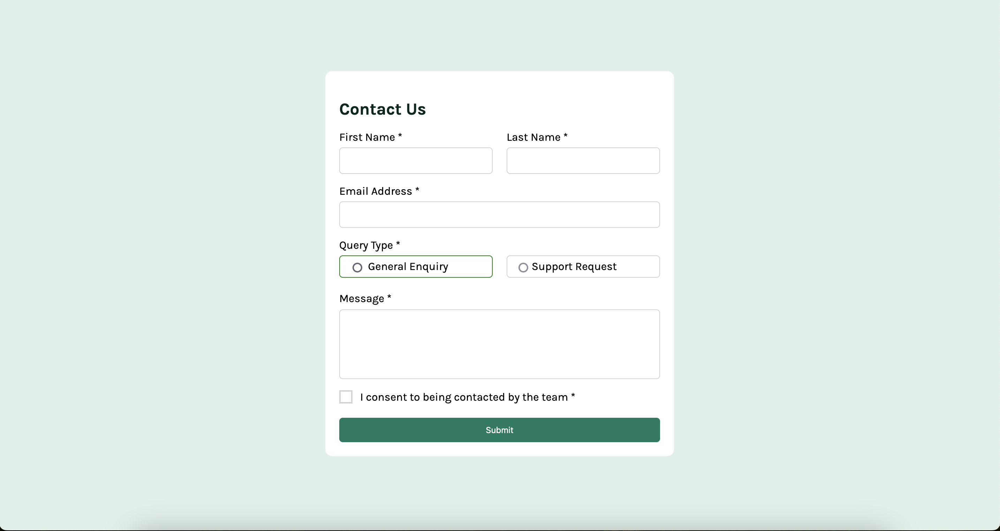

# Frontend Mentor - Contact form solution

This is a solution to the [Contact form challenge on Frontend Mentor](https://www.frontendmentor.io/challenges/contact-form--G-hYlqKJj). Frontend Mentor challenges help you improve your coding skills by building realistic projects.

### Screenshot

### Links

[https://github.com/nj93777/contact-form-main]
[https://nj93777.github.io/contact-form-main/]

## My process

### Built with

- CSS custom properties
- Flexbox
